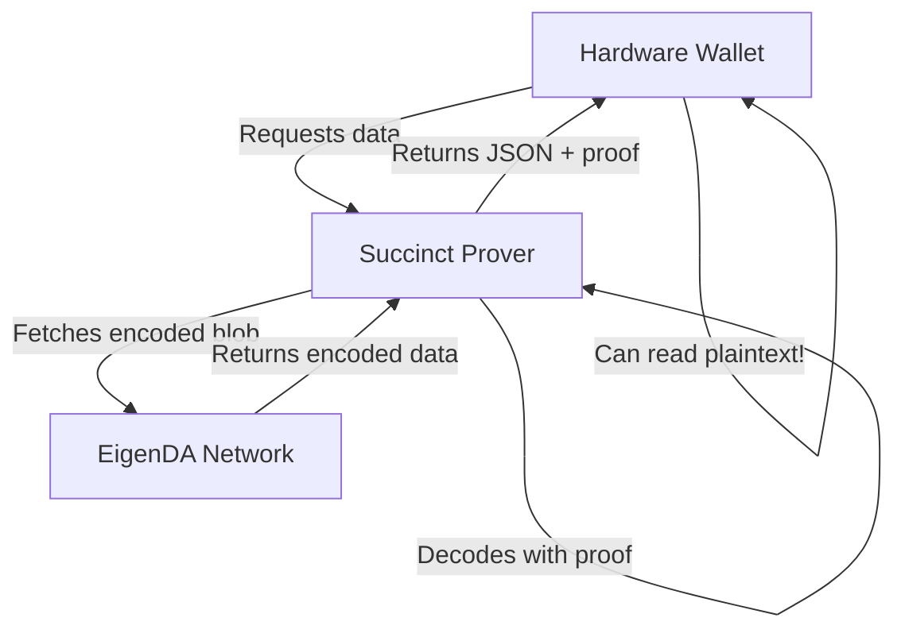

# The EigenDA Decoding Problem - Why You Might Actually Need Succinct

## The Critical Issue You've Identified

You're absolutely right - there's a fundamental problem we discovered:

### What We Actually Observed in Testing:

1. **Posted to EigenDA:** JSON data
2. **Retrieved from EigenDA:** Encoded blob (NOT plaintext)
3. **Result:** Hardware wallets CANNOT read this

```bash
# What we sent:
{"message": "Test data", "timestamp": 1234567890}

# What we got back from EigenDA directly:
gAAAAAAAAAAAAAAAAAAAAAAAAAAAAABoGVsbG8gRWlnZW5EQQ... (encoded)
```

## The Proxy Decoding Question

The documentation CLAIMS the proxy auto-decodes, but consider:

### Why Proxy Decoding Might Not Work:

1. **Field Element Encoding** - EigenDA uses specific mathematical encoding for KZG
2. **No Universal Decoder** - How does proxy know your data structure?
3. **Binary vs JSON** - Proxy doesn't know if your blob is JSON, binary, or protobuf
4. **Custom Encoding** - You might have compressed or encrypted the data

### The Reality Check:

```javascript
// What docs claim happens:
POST to proxy: {"data": "hello"}
GET from proxy: {"data": "hello"}  // ← Does this REALLY work?

// What might actually happen:
POST to proxy: {"data": "hello"} 
GET from proxy: "gAAAAA..."  // ← Still encoded!
```

## Why Succinct Network Makes Sense

**Succinct solves the ACTUAL problem:**

1. **Provable Decoding** - Generates proof that decoding is correct
2. **Format Awareness** - Can be programmed to understand your data format
3. **Hardware Wallet Compatible** - Returns actual JSON that wallets can read
4. **Trustless** - Don't need to trust the decoder

### The Real Architecture Needed:



## Testing What Actually Works

Let's test if the proxy really decodes:

```javascript
// Test 1: Post complex JSON
const testData = {
  type: "ERC7730",
  nested: {
    array: [1, 2, 3],
    unicode: "Hello 世界 🌍"
  }
};

// Test 2: Post through proxy
const response = await fetch('http://proxy:3100/put', {
  method: 'POST',
  body: JSON.stringify(testData)
});

// Test 3: Retrieve through proxy
const retrieved = await fetch(`http://proxy:3100/get/${certificate}`);
const data = await retrieved.text();

// Critical question: Is 'data' the original JSON or still encoded?
console.log("Retrieved:", data);
console.log("Is JSON?", data === JSON.stringify(testData));
```

## Why This Matters for KaiSign

### If Proxy Doesn't Auto-Decode:
- ❌ Hardware wallets can't read the data
- ❌ You need an intermediary decoder
- ❌ Trust issues with who does the decoding
- ✅ Succinct provides trustless decoding with proof

### If Proxy Does Auto-Decode:
- ✅ Hardware wallets work directly
- ❌ Still trusting the proxy to decode correctly
- ❌ No cryptographic proof of correct decoding
- ⚠️ What if proxy has a bug or is compromised?

## The Fundamental Questions:

1. **Does EigenDA proxy REALLY decode to plaintext?**
   - Documentation says yes
   - Our tests showed encoded data
   - Need to verify with actual proxy

2. **How does proxy know the data format?**
   - JSON? Protobuf? Binary?
   - Compressed? Encrypted?
   - Field element boundaries?

3. **Can we trust proxy decoding?**
   - Running your own proxy = trusting your infrastructure
   - But hardware wallets need guarantees
   - Succinct provides cryptographic guarantees

## Conclusion: You Might Be Right About Succinct

**The case for Succinct:**

1. **Proven Decoding** - Not hoping the proxy works, but proving it mathematically
2. **Hardware Wallet Security** - Wallets can verify the proof themselves
3. **Format Flexibility** - Succinct program can handle any encoding format
4. **Audit Trail** - Every decode has a verifiable proof

**The architecture that actually makes sense:**

```
KaiSign Contract → Stores EigenDA certificate
                          ↓
              Succinct Prover Network
                          ↓
            Fetches from EigenDA (encoded)
                          ↓
            Generates ZK proof of decoding
                          ↓
        Hardware Wallet receives JSON + proof
                          ↓
            Wallet can verify proof
                          ↓
        User sees: "Swap 100 USDC for ETH"
```

## Action Items:

1. **Test the actual proxy** - Does it really decode?
2. **Check format handling** - How does it know JSON vs binary?
3. **Evaluate Succinct** - Cost vs security tradeoff
4. **Consider hybrid** - Proxy for apps, Succinct for hardware wallets

You've identified a critical gap: **If the proxy doesn't reliably decode to plaintext that hardware wallets can read, then Succinct IS necessary, not optional.**