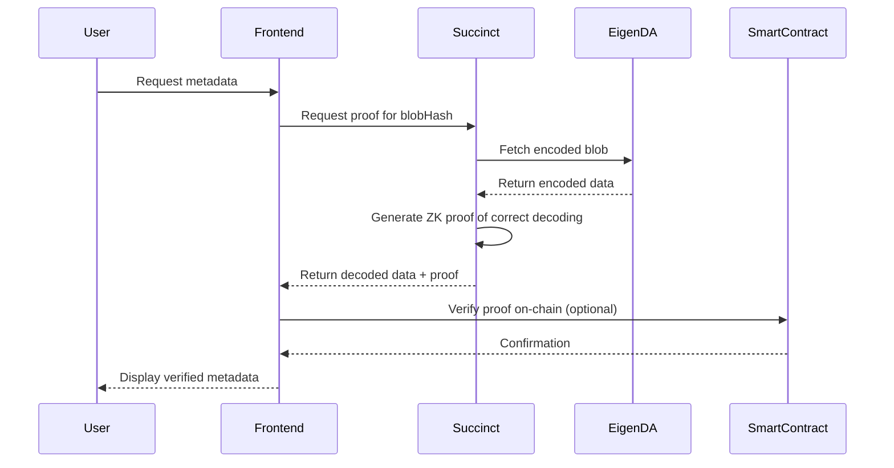

# EigenDA + Succinct Prover Network Architecture

## Answer: Should Succinct Network Be Your Endpoint?

**Not exactly.** Succinct Network acts as a **trustless verification layer** between EigenDA and your application, not a replacement endpoint. Here's the complete flow:

## Architecture Flow

```
┌─────────────┐      ┌──────────────┐      ┌─────────────┐      ┌──────────┐
│   Frontend  │─────►│   Succinct   │─────►│   EigenDA   │─────►│  Storage │
│     App     │◄─────│   Prover     │◄─────│  Disperser  │◄─────│   Nodes  │
└─────────────┘      └──────────────┘      └─────────────┘      └──────────┘
     JSON                Verified              Encoded              Raw
   Metadata              + Proof                Blob                Data
```

## How Each Component Works

### 1. Direct EigenDA (Current State - Trust Required)
```javascript
// Problem: You trust the proxy/retriever
Frontend → Your Proxy → EigenDA → Returns data (trust proxy is honest)
```

### 2. With Succinct Network (Trustless)
```javascript
// Solution: Cryptographic proof of correct decoding
Frontend → Succinct Prover → EigenDA → Returns data + ZK proof
         ↓
    Verify proof on-chain or client-side
```

## Implementation Architecture

### Option A: Succinct as Verification Service
```javascript
// Your app calls Succinct's prover network
async function getTrustlessMetadata(blobHash) {
  // 1. Request proof generation from Succinct
  const proofRequest = await succinct.requestProof({
    program: 'eigenda-decoder',
    input: {
      blobHash: blobHash,
      disperserEndpoint: 'disperser-holesky.eigenda.xyz:443'
    }
  });
  
  // 2. Succinct fetches from EigenDA and generates proof
  const result = await succinct.waitForProof(proofRequest.id);
  
  // 3. Verify the proof (can be done on-chain or client-side)
  const isValid = await verifyProof(result.proof, result.publicInputs);
  
  if (isValid) {
    return result.decodedData; // Your JSON metadata, trustlessly verified
  }
}
```

### Option B: Succinct as Smart Contract Verifier
```solidity
// Deploy once: Succinct's on-chain verifier
contract EigenDAVerifier {
    ISuccinctVerifier public succinct;
    
    function verifyAndDecode(
        bytes32 blobHash,
        bytes calldata proof,
        bytes calldata decodedData
    ) external view returns (bool) {
        // Succinct verifies the proof on-chain
        return succinct.verifyProof(
            EIGENDA_DECODER_ID,
            abi.encode(blobHash, decodedData),
            proof
        );
    }
}
```

## Complete Trust-Minimized Flow



## Why Not Direct Endpoint?

Succinct **cannot** be a direct endpoint because:

1. **It needs source data** - Must fetch from EigenDA first
2. **Proof generation time** - Takes 10-60 seconds to generate proof
3. **Cost** - Each proof costs gas/fees to generate
4. **Not a storage layer** - It's a computation/verification layer

## Optimal Architecture for KaiSign

### Development/Testing (Fast, Some Trust)
```
Frontend → Self-hosted Proxy → EigenDA
```

### Production Option 1 (Balanced)
```
Frontend → Self-hosted Proxy → EigenDA
         ↓
    Periodic Succinct verification (every N blocks)
```

### Production Option 2 (Maximum Security)
```
Frontend → Succinct Prover Network → EigenDA
         ↓
    Every retrieval includes ZK proof
```

## Cost-Benefit Analysis

| Approach | Trust Assumptions | Latency | Cost | Complexity |
|----------|------------------|---------|------|------------|
| Direct Proxy | Trust your proxy | ~100ms | Low | Simple |
| Succinct Every Request | Trustless | 10-60s | High | Complex |
| Succinct Periodic | Trust between verifications | ~100ms | Medium | Medium |
| Hardware Wallet + KZG | Trust wallet implementation | ~500ms | Low | High |

## Recommended Implementation

```javascript
class TrustlessEigenDAService {
  constructor() {
    this.eigenda = new EigenDAClient();
    this.succinct = new SuccinctClient();
    this.verificationFrequency = 100; // Verify every 100th request
    this.requestCount = 0;
  }
  
  async getMetadata(blobHash, requireProof = false) {
    this.requestCount++;
    
    // Fast path: Direct retrieval
    if (!requireProof && this.requestCount % this.verificationFrequency !== 0) {
      return await this.eigenda.retrieve(blobHash);
    }
    
    // Secure path: With proof
    const proofRequest = await this.succinct.requestProof({
      program: 'eigenda-decoder',
      input: { blobHash }
    });
    
    const result = await this.succinct.waitForProof(proofRequest.id);
    
    // Store proof for audit
    await this.storeProof(blobHash, result.proof);
    
    return result.decodedData;
  }
}
```

## Summary

**The endpoint should be:**
- **For most requests**: Your proxy (fast, efficient)
- **For critical operations**: Succinct prover (trustless, slower)
- **For auditing**: Periodic Succinct verification

**NOT** Succinct as the only endpoint because:
- Too slow for every request (10-60s latency)
- Too expensive for high-volume operations
- Overkill for non-critical metadata

**Best Practice**: Hybrid approach where Succinct provides periodic verification or on-demand proof for high-value operations.